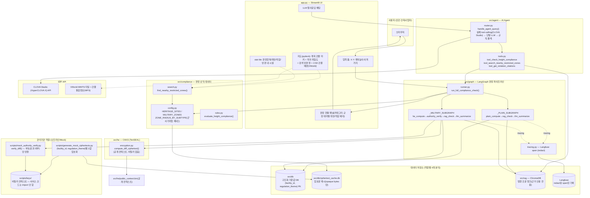

# 시스템 아키텍처

## 컴포넌트 다이어그램

## 계층별 책임 요약

| 계층 | 책임 | 하지 않는 것 |
|---|---|---|
| `app.py` | 입력 폼, 결과 렌더링, 지도(마커+격자+반경 원+2.5D 배경) | HE 연산, 판정 로직 직접 구현 |
| `src/compliance` | 시설 데이터(실 성남시 좌표) + 반경 검색 + 3개 판정 공식 | 암호문 복호화 |
| `src/graph` | LangGraph 오케스트레이션, 노드별 트레이싱 | UI 렌더링 |
| `src/he` | CKKS 암호문-평문 뺄셈(공개 컨텍스트만) | 복호화(비밀키 없음) |
| `src/db` | facility_id/regulation_theme 기반 정확 대조용 저장소 2종(구조화 DB, 암호문 캐시) | 벡터 유사도 검색 |
| `src/rag` | 법령 조문 근거 인용(벡터 검색) | 판정 자체 |
| `src/agent` | function-calling 기반 채팅, 실제 판정 결과만 요약 | 판정 재계산(그래프 재실행) |
| `scripts/` (관리기관 역할) | 비밀키 보유, Z값 암호화, 부호만 반환 | 서비스 코드에서 import됨 |

## 신뢰 경계(Trust boundary)

- **서비스(app.py, src/) 프로세스는 비밀키를 어디에도 갖지 않는다.** 비밀키는 `scripts/keys/`에만 있고, 이 파일들을 로드하는 코드는 `scripts/generate_mock_ciphertexts.py`·`scripts/mock_authority_verify.py` 두 개뿐이며 둘 다 관리기관 역할을 흉내내는 오프라인 스크립트다.
- 서비스가 실제로 수행하는 유일한 암호 연산은 `compute_diff_ciphertext()`(암호문-평문 뺄셈)이고, 그 결과(diff 암호문)는 절대 서비스 내부에서 복호화되지 않는다.
