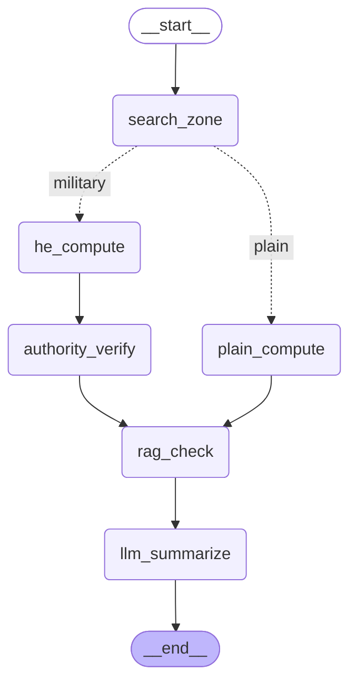
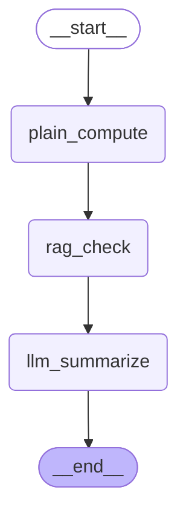
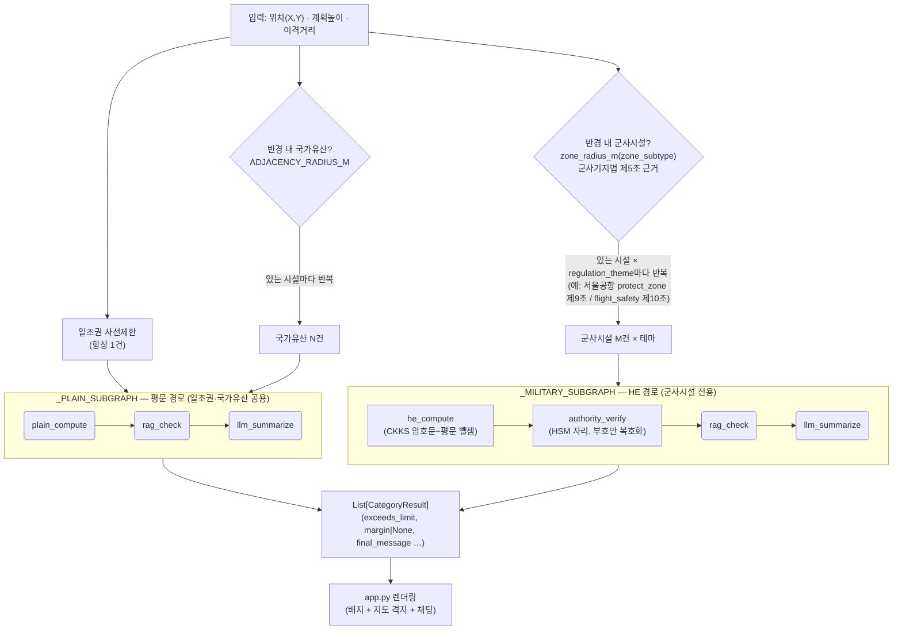

# LangGraph 그래프 구조

아래 Mermaid는 손으로 그린 것이 아니라, 실제 컴파일된 LangGraph 인스턴스에서
`graph.get_graph().draw_mermaid()`로 직접 추출한 것이다(코드와 다이어그램이 어긋날 수
없다). 추출 방법:

```bash
python -c "
from src.graph.build import build_compliance_graph
from src.graph.runner import _MILITARY_SUBGRAPH, _PLAIN_SUBGRAPH
print(build_compliance_graph().get_graph().draw_mermaid())
print(_MILITARY_SUBGRAPH.get_graph().draw_mermaid())
print(_PLAIN_SUBGRAPH.get_graph().draw_mermaid())
"
```

## 1. 레퍼런스/테스트 그래프 — `src/graph/build.py`

`tests/test_graph_end_to_end.py`용 단일-진입 그래프. 계획 건물 1건당 시설 1건만
판정하는 구조라 `search_zone_node`가 반경 내 시설을 우선순위(군사시설 → 국가유산 →
일조권)로 하나만 골라 그 이후 경로를 조건부 분기한다.



## 2. 실제 서비스 경로 — `src/graph/runner.py`

Streamlit 앱(`app.py`)이 실제로 쓰는 경로. `search_zone_node`를 거치지 않고, 두 서브
그래프(`_MILITARY_SUBGRAPH`/`_PLAIN_SUBGRAPH`)를 `run_full_compliance_check()`가
직접 여러 번 호출한다 — 한 건물이 여러 카테고리·여러 규정 테마를 동시에 위반할 수
있어야 하기 때문이다(아래 "오케스트레이션" 절 참고).

### 2-1. `_MILITARY_SUBGRAPH` (HE 경로)


### 2-2. `_PLAIN_SUBGRAPH` (평문 경로 — 일조권/국가유산)



## 3. 통합 뷰 — 실제로 도는 전체 흐름을 한 장으로

위 1·2번은 각각 "레퍼런스 그래프 1장" / "서브그래프 내부 노드 2장"으로 쪼개져 있어서,
그것만 보면 "그럼 한 건물이 일조권+국가유산+군사시설을 동시에 위반하는 건 실제로
어떻게 처리되는가"가 한눈에 안 들어온다는 지적이 있었다. 아래는 `src/graph/runner.py::run_full_compliance_check`가
실제로 실행하는 오케스트레이션(몇 번 반복하는가)과 서브그래프 내부 노드 시퀀스를
**하나의 다이어그램**으로 합친 것이다 — 발표에서는 1·2번 대신 이 다이어그램 하나만
보여줘도 된다.



- `search_zone_node`는 이 경로에 아예 등장하지 않는다 — "시설 1건만 골라서 분기"하는
  레퍼런스 그래프(1번)와 달리, `runner.py`는 카테고리별로 **후보 시설을 전부 순회하며
  서브그래프를 여러 번 직접 `invoke()`한다**. 그래서 한 건물이 세 카테고리를 동시에
  위반해도 각각 독립된 `CategoryResult`로 리스트에 쌓인다.
- 군사시설은 시설 1건이라도 규정 테마(현재 서울공항은 `protect_zone`/`flight_safety`
  2개)마다 `_MILITARY_SUBGRAPH`를 독립적으로 한 번씩 실행한다 — 같은 시설이라도
  테마별로 위반/적합이 갈릴 수 있기 때문이다.
- HE 경로만 `authority_verify`(HSM 부호 검증)를 거치고, 평문 경로(일조권/국가유산)는
  `plain_compute` 결과를 바로 `rag_check`로 넘긴다 — CLAUDE.md 절대 원칙 1대로 diff
  암호문은 서비스 내부 어디서도 복호화하지 않는다.
