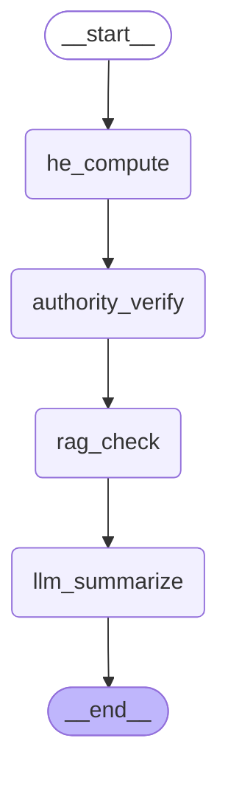

# LangGraph 그래프 구조

아래 Mermaid는 손으로 그린 것이 아니라, 실제 컴파일된 LangGraph 인스턴스에서
`graph.get_graph().draw_mermaid()`로 직접 추출한 것이다(코드와 다이어그램이 어긋날 수
없다). 추출 방법:

```bash
python -c "
from src.graph.build import build_compliance_graph
from src.graph.runner import _MILITARY_SUBGRAPH, _PLAIN_SUBGRAPH
print(build_compliance_graph().get_graph().draw_mermaid())
print(_MILITARY_SUBGRAPH.get_graph().draw_mermaid())
print(_PLAIN_SUBGRAPH.get_graph().draw_mermaid())
"
```

## 1. 레퍼런스/테스트 그래프 — `src/graph/build.py`

`tests/test_graph_end_to_end.py`용 단일-진입 그래프. 계획 건물 1건당 시설 1건만
판정하는 구조라 `search_zone_node`가 반경 내 시설을 우선순위(군사시설 → 국가유산 →
일조권)로 하나만 골라 그 이후 경로를 조건부 분기한다.


## 2. 실제 서비스 경로 — `src/graph/runner.py`

Streamlit 앱(`app.py`)이 실제로 쓰는 경로. `search_zone_node`를 거치지 않고, 두 서브
그래프(`_MILITARY_SUBGRAPH`/`_PLAIN_SUBGRAPH`)를 `run_full_compliance_check()`가
직접 여러 번 호출한다 — 한 건물이 여러 카테고리·여러 규정 테마를 동시에 위반할 수
있어야 하기 때문이다(아래 "오케스트레이션" 절 참고).

### 2-1. `_MILITARY_SUBGRAPH` (HE 경로)



### 2-2. `_PLAIN_SUBGRAPH` (평문 경로 — 일조권/국가유산)


## 3. 오케스트레이션 — 서브그래프를 몇 번 실행하는가

`run_full_compliance_check(plan_x, plan_y, plan_height, setback_distance)`는:

```mermaid
flowchart TD
    A[입력: 위치 X,Y / 계획높이 / 이격거리] --> B["_PLAIN_SUBGRAPH 1회<br/>(일조권 사선제한, 항상 실행)"]
    A --> C{반경 내 국가유산?<br/>ADJACENCY_RADIUS_M}
    C -- 있음 --> D["_PLAIN_SUBGRAPH 1회<br/>(국가유산, 시설마다)"]
    A --> E{반경 내 군사시설?<br/>zone_radius_m(zone_subtype)<br/>군사기지법 제5조 근거}
    E -- 있음 --> F["_MILITARY_SUBGRAPH 1회<br/>× regulation_theme 개수<br/>(protect_zone 제9조 / flight_safety 제10조)"]
    B --> G[CategoryResult 리스트로 합쳐 반환]
    D --> G
    F --> G
```

군사시설은 시설 1건이라도 규정 테마(현재 서울공항은 `protect_zone`/`flight_safety`
2개)마다 서브그래프를 독립적으로 한 번씩 실행한다 — 같은 시설이라도 테마별로
위반/적합이 갈릴 수 있기 때문이다(`src/graph/runner.py::run_full_compliance_check`).
