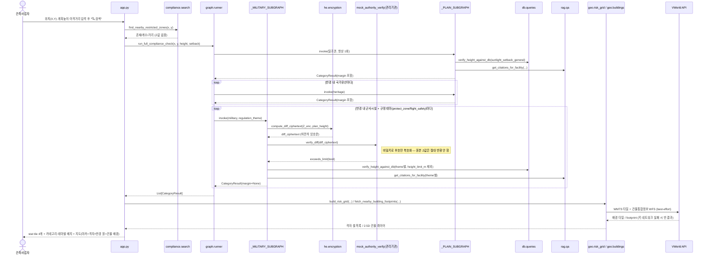
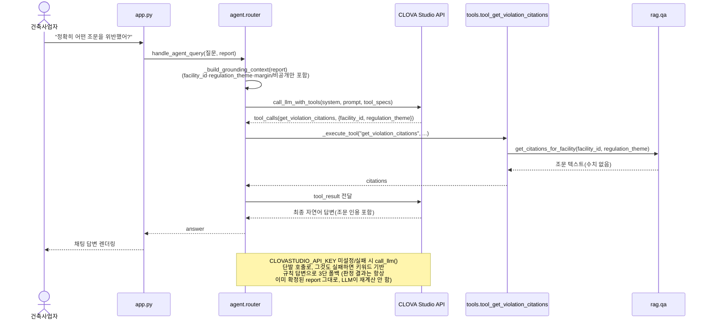

# 시퀀스 다이어그램

## 1. 검색 → 반경 조회 → 다중 테마 판정 → 지도/현황 렌더링

```mermaid
sequenceDiagram
    actor U as 건축사업자
    participant App as app.py
    participant Search as compliance.search
    participant Runner as graph.runner
    participant MilSub as _MILITARY_SUBGRAPH
    participant HE as he.encryption
    participant Verify as mock_authority_verify(관리기관)
    participant PlainSub as _PLAIN_SUBGRAPH
    participant DB as db.queries
    participant RAG as rag.qa
    participant Geo as geo.risk_grid / geo.buildings
    participant VWorld as VWorld API

    U->>App: 위치(X,Y)·계획높이·이격거리 입력 후 "🔍 검색"
    App->>Search: find_nearby_restricted_zones(x, y)
    Search-->>App: 존재/개수/거리 (Z값 없음)
    App->>Runner: run_full_compliance_check(x, y, height, setback)

    Runner->>PlainSub: invoke(일조권, 항상 1회)
    PlainSub->>DB: verify_height_against_db(sunlight_setback_general)
    PlainSub->>RAG: get_citations_for_facility(...)
    PlainSub-->>Runner: CategoryResult(margin 포함)

    loop 반경 내 국가유산마다
        Runner->>PlainSub: invoke(heritage)
        PlainSub-->>Runner: CategoryResult(margin 포함)
    end

    loop 반경 내 군사시설 × 규정 테마(protect_zone/flight_safety)마다
        Runner->>MilSub: invoke(military, regulation_theme)
        MilSub->>HE: compute_diff_ciphertext(Z_enc, plan_height)
        HE-->>MilSub: diff_ciphertext (여전히 암호문)
        MilSub->>Verify: verify_diff(diff_ciphertext)
        Note right of Verify: 비밀키로 부호만 복호화 — 원본 Z값은 절대 반환 안 함
        Verify-->>MilSub: exceeds_limit(bool)
        MilSub->>DB: verify_height_against_db(theme별, height_limit_m 제외)
        MilSub->>RAG: get_citations_for_facility(theme별)
        MilSub-->>Runner: CategoryResult(margin=None)
    end

    Runner-->>App: List[CategoryResult]
    App->>Geo: build_risk_grid(...) / fetch_nearby_building_footprints(...)
    Geo->>VWorld: WMTS 타일 + 건물통합정보 WFS (best-effort)
    VWorld-->>Geo: 배경 타일 / footprint (키·네트워크 실패 시 빈 결과)
    Geo-->>App: 격자 셀 목록 / 2.5D 건물 레이어
    App-->>U: stat tile 4개 + 카테고리·테마별 배지 + 지도(마커+격자+반경 원+건물 배경)
```

## 2. 챗봇 — 실제 tool-calling으로 근거 조문 질의

```mermaid
sequenceDiagram
    actor U as 건축사업자
    participant App as app.py
    participant Router as agent.router
    participant Clova as CLOVA Studio API
    participant Tool as tools.tool_get_violation_citations
    participant RAG as rag.qa

    U->>App: "정확히 어떤 조문을 위반했어?"
    App->>Router: handle_agent_query(질문, report)
    Router->>Router: _build_grounding_context(report)<br/>(facility_id·regulation_theme·margin/비공개만 포함)
    Router->>Clova: call_llm_with_tools(system, prompt, tool_specs)
    Clova-->>Router: tool_calls(get_violation_citations, {facility_id, regulation_theme})
    Router->>Tool: _execute_tool("get_violation_citations", ...)
    Tool->>RAG: get_citations_for_facility(facility_id, regulation_theme)
    RAG-->>Tool: 조문 텍스트(수치 없음)
    Tool-->>Router: citations
    Router->>Clova: tool_result 전달
    Clova-->>Router: 최종 자연어 답변(조문 인용 포함)
    Router-->>App: answer
    App-->>U: 채팅 답변 렌더링

    Note over Router,Clova: CLOVASTUDIO_API_KEY 미설정/실패 시 call_llm()<br/>단발 호출로, 그것도 실패하면 키워드 기반<br/>규칙 답변으로 3단 폴백 (판정 결과는 항상<br/>이미 확정된 report 그대로, LLM이 재계산 안 함)
```
